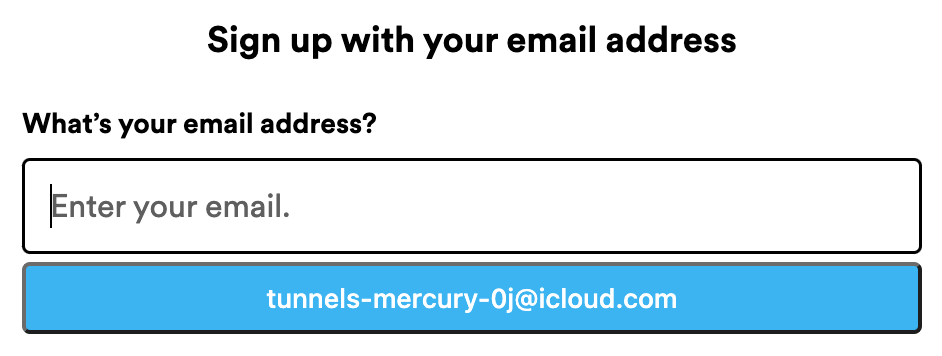

# iCloud Hide My Email Browser Extension

[](https://github.com/dedoussis/icloud-hide-my-email-browser-extension/actions/workflows/tests.yml)

[Hide My Email](https://support.apple.com/en-us/HT210425) is a premium privacy service of iCloud. Safari offers a native integration with Hide My Email, whereby users are prompted to generate a Hide My Email address upon registration to any website. This extension aims to bring a similar UX into a wider variety of browsers. In particular, it has been explicitly tested to work on:

- [Chrome](https://chrome.google.com/webstore/detail/icloud-hide-my-email/omiaekblhgfopjkjnenhahfgcgnbohlk)
- [Firefox](https://addons.mozilla.org/en-US/firefox/addon/icloud-hide-my-email/)
- [Brave](https://chrome.google.com/webstore/detail/icloud-hide-my-email/omiaekblhgfopjkjnenhahfgcgnbohlk)
- Microsoft Edge

Note that the extension _should_ work on any browser that implements the [extension API](https://developer.chrome.com/docs/extensions/reference/) supported by Chromium-based browsers (regardless of manifest version).

_Disclaimer: This extension is not endorsed by, directly affiliated with, maintained, authorized, or sponsored by Apple._

<p align="center">

</p>

<p align="center">

</p>

## Features

- Simple pop-up UI for generating and reserving new Hide My Email addresses
- Ability to manage existing Hide My Email addresses (including deactivation, reactivation, and deletion)
- Autofilling on any HTML input element that is relevant to email
- Quick configuration of Hide My Email settings, such as the Forward-To address, through the Options page of the extension

## Options

### Address autofilling

The extension can be configured to

1. show an autofill button on input field focus
2. show a context menu item when right-clicking on input fields

<p align="center">

</p>

<p align="center">

</p>

You can enable/disable any of the autofilling mechanisms through the Options page of the extension.

## Develop

This extension is entirely written in TypeScript. The UI pages of the extension (e.g. Pop-Up and Options) are implemented as React apps and styled with TailwindCSS.

The extension was originally developed to solely use [Manifest V3](https://developer.chrome.com/docs/extensions/mv3/intro/mv3-overview/) APIs. However, since most browsers have not caught up with MV3, MV2 compatibility has been introduced.

### Environment

Development was carried out in the following environment:

```console
$ sw_vers
ProductName:	macOS
ProductVersion:	12.5
BuildVersion:	21G72

$ sysctl kern.version
kern.version: Darwin Kernel Version 21.6.0: Sat Jun 18 17:07:25 PDT 2022; root:xnu-8020.140.41~1/RELEASE_X86_64

$ node --version
v18.11.0

$ npm --version
8.19.2

$ pkgutil --pkg-info=com.apple.pkg.CLTools_Executables | grep version  # CommandLineTools needed for node-gyp
version: 13.4.0.0.1.1651278267

$ python3 --version  # needed for node-gyp
Python 3.10.5
```

The above versions should not be regarded as hard version pins. This is just a combination of versions that happened to successfully build the extension on my machine. The following Dockerfile has been used to successfully build the extension and provides a much cleaner runtime contract:

```Dockerfile
FROM node:18.12.1-alpine3.17

RUN apk add --update --no-cache g++ make python3

ADD . /opt/extension

WORKDIR /opt/extension

ENTRYPOINT ["sh"]
```

### Development workflow

The table below outlines the sequence of steps that need to be followed in order to ship a change in the extension. The execution of some of these steps varies per browser/manifest version.

Note: the following console commands are to be executed from the root directory of this repo

<!-- prettier-ignore-start -->
| # | Description | MV3 (Chromium) | MV2 (Firefox) |
| - | - | - | - |
| 0 | Install deps | `npm ci` | `npm ci && npm i -g web-ext` |
| 1 | Spin up the DevServer. The server generates the `build` dir. | `npm run start` | `npm run start:mv2` |
| 2 | Load the unpacked extension on the browser |  The `build` dir can be loaded as an unpacked extension through the browser's UI. See the relevant [Google Chrome guide](https://developer.chrome.com/docs/extensions/mv3/getstarted/development-basics/#load-unpacked). | `web-ext -s build run` |
| 3 | Develop against the local browser instance on which the `build` dir is loaded | N/A | N/A |
| 4 | Build productionised artefact | `npm run build` | `npm run build:mv2` |
| 5 | Compress productionised artefact | `zip build.zip ./build/*` | `web-ext -s build build` |
| 6 | Publish | [Chrome webstore dev console](https://chrome.google.com/webstore/devconsole/) | [Mozilla Add-on developer hub](https://addons.mozilla.org/en-US/developers/addon/icloud-hide-my-email/versions/submit/) |
<!-- prettier-ignore-end -->

### TODOs

- [ ] Ability to modify the label and note of existing HME addresses
- [ ] CI and maybe CD
- [ ] Dependabot
