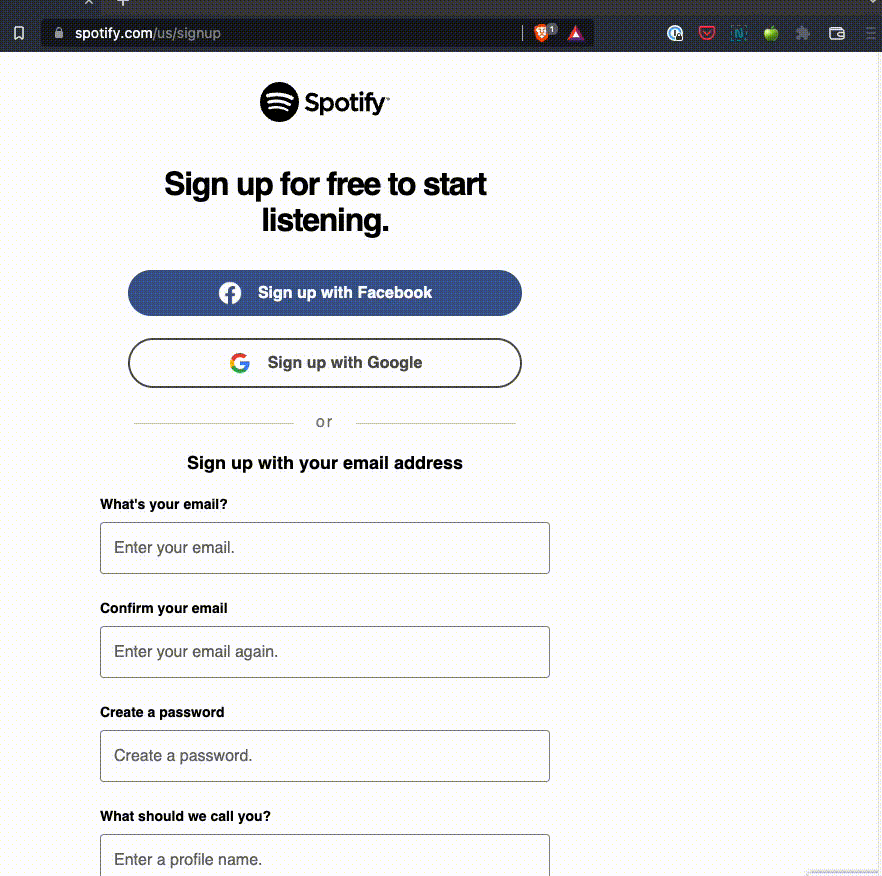

# iCloud Hide My Email Browser Extension

[](https://github.com/dedoussis/icloud-hide-my-email-browser-extension/actions/workflows/tests.yml)

[Hide My Email](https://support.apple.com/en-us/HT210425) is a premium feature of iCloud that is natively supported in Safari. This extension aims to bring a similar UX to a wider variety of browsers. In particular, it has been explicitly tested to work on:

- Chrome
- Firefox
- Brave
- Microsoft Edge

Note that the extension _should_ work on any browser that implements the [extension API](https://developer.chrome.com/docs/extensions/reference/) supported by Chromium-based browsers (regardless of manifest version).

_Disclaimer: This extension is not endorsed by, directly affiliated with, maintained, authorized, or sponsored by Apple._




## Features

- Simple pop-up UI for generating and reserving new Hide My Email addresses
- Ability to manage existing Hide My Email addresses (including deactivation, reactivation, and deletion)
- Autofilling on any HTML input element that is relevant to email
- Quick configuration of Hide My Email settings, such as the Forward-To address, through the Options page of the extension

## Develop

This extension is entirely writen in TypeScript. The UI pages of the extension (e.g. Pop-Up and Options) are implemented as React apps and styled with TailwindCSS.

Version 18.xx of Node.js was used for development.

The extension was originally developed to solely use [Manifest V3](https://developer.chrome.com/docs/extensions/mv3/intro/mv3-overview/) APIs. However, since most browsers have not caught up with MV3, MV2 compatibility has been introduced.

Note: the following console commands are to be executed from the root directory of this repo.

### Spin up DevServer

```console
$ npm run start
```

For Manifest Version 2:

```console
$ npm run start:mv2
```

### Load on browser

#### Chromium-based

The generated `build` directory can be loaded as an unpacked extension through the browser's UI. See the relevant [Google Chrome guide](https://developer.chrome.com/docs/extensions/mv3/getstarted/development-basics/#load-unpacked). The same workflow may be used across all Chromium-based browsers.

#### Firefox

```console
$ web-ext -s build run
```

### Package

The following command generates a productionised unpacked artefact (under the `build` directory):

```console
$ npm run build
```

For Manifest Version 2:

```console
$ npm run build:mv2
```

Prior to publishing the extension, the unpacked artefact must be compressed:

```console
$ zip build.zip ./build/*
```

or for Firefox:

```console
$ web-ext -s build build
```

### TODOs

- [ ] Ability to search for existing HME addresses
- [ ] Ability to modify the label and note of existing HME addresses
- [ ] Options page to validate client token
- [ ] Expiration of session data stored in Chrome storage
- [ ] CI/CD
- [ ] Dependabot
