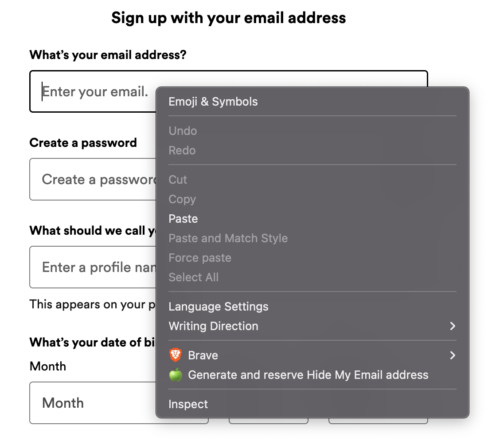

# Hide My Email+ Browser Extension

This is a fork of the [icloud-hide-my-email-browser-extension](https://github.com/dedoussis/icloud-hide-my-email-browser-extension) by Dimitrios Dedoussis, with some modifications by Sachit Vithaldas.

Hide My Email+ builds on iCloud's [Hide My Email](https://support.apple.com/en-us/HT210425) privacy service. Safari offers a native integration with Hide My Email, whereby users are prompted to generate a Hide My Email address upon registration to any website. This extension aims to bring a similar UX into a wider variety of browsers. In particular, it has been explicitly tested to work on:

- [Chrome](https://chrome.google.com/webstore/detail/icloud-hide-my-email/omiaekblhgfopjkjnenhahfgcgnbohlk)
- [Firefox](https://addons.mozilla.org/en-US/firefox/addon/icloud-hide-my-email/)
- [Brave](https://chrome.google.com/webstore/detail/icloud-hide-my-email/omiaekblhgfopjkjnenhahfgcgnbohlk)
- Microsoft Edge

Note that the extension _should_ work on any browser that implements the [extension API](https://developer.chrome.com/docs/extensions/reference/) supported by Chromium-based browsers.

_Disclaimer: This extension is not endorsed by, directly affiliated with, maintained, authorized, or sponsored by Apple._

## Features

- Simple pop-up UI for generating and reserving new Hide My Email+ aliases
- Ability to manage existing Hide My Email+ aliases (including deactivation, reactivation, and deletion)
- Autofilling on any HTML input element that is relevant to email
- Quick configuration of Hide My Email+ settings, such as the Forward-To address, through the Options page of the extension

## Options

### Address autofilling

The extension can be configured to

1. show an autofill button on input field focus
2. show a context menu item when right-clicking on input fields

You can enable/disable any of the autofilling mechanisms through the Options page of the extension.

## Develop

This extension is entirely written in TypeScript. The UI pages of the extension (e.g. Pop-Up and Options) are implemented as React apps and styled with Tailwind CSS.

### Environment

#### Prerequisites

- Node.js 22 LTS.

Once the prerequisites are installed, run `npm install` from the repository root to bootstrap the project.

### Development workflow

The table below outlines the sequence of steps that need to be followed in order to ship a change in the extension. The execution of some of these steps varies per browser engine.

Note: the following console commands are to be executed from the root directory of this repo

<!-- prettier-ignore-start -->
| # | Description | Chromium | Firefox |
| - | - | - | - |
| 0 | Install deps | `npm ci` | `npm ci && npm i -g web-ext` |
| 1 | Spin up the dev server. The server generates the `build` dir. | `npm run start` | `npm run start:firefox` |
| 2 | Load the unpacked extension on the browser |  The `build` dir can be loaded as an unpacked extension through the browser's UI. See the relevant [Google Chrome guide](https://developer.chrome.com/docs/extensions/mv3/getstarted/development-basics/#load-unpacked). | `web-ext -s build run` |
| 3 | Develop against the local browser instance on which the `build` dir is loaded | N/A | N/A |
| 4 | Build productionized artifact | `npm run build` | `npm run build:firefox` |
| 5 | Compress productionized artifact | `zip build.zip ./build/*` | `web-ext -s build build` |
| 6 | Publish | [Chrome Web Store developer console](https://chrome.google.com/webstore/devconsole/) | [Mozilla Add-on Developer Hub](https://addons.mozilla.org/en-US/developers/addon/icloud-hide-my-email/versions/submit/) |
<!-- prettier-ignore-end -->

### TODOs

- [ ] Continuous Deployment
